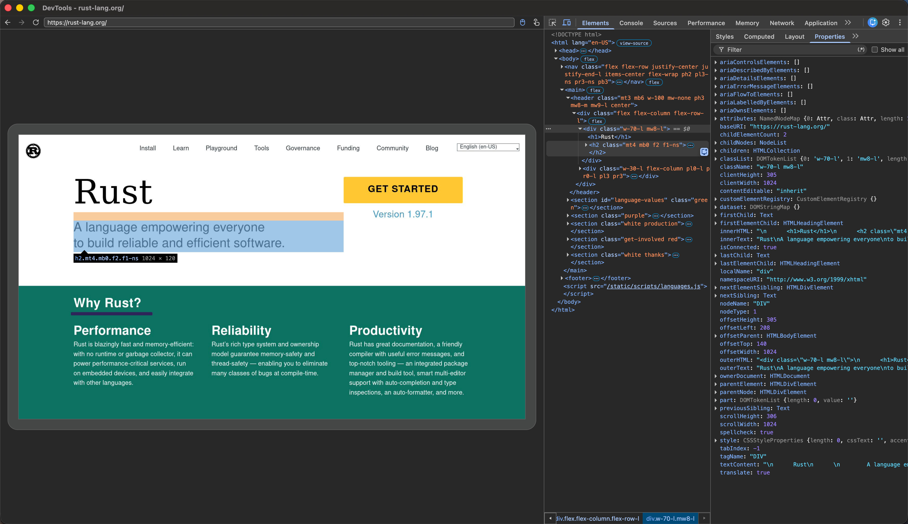

<p align="center">
  
</p>

<h1 align="center">Moli</h1>

Moli is a production-ready, structured-first browser engine for AI agents.

It runs real JavaScript, DOM, and browser APIs by default, and computes layout
or pixels only when requested.

Use it through CLI, CDP, WebDriver Classic, or WebDriver BiDi.

## Why Moli

Most browser automation needs page structure, not a continuously rendered
visual world. Moli keeps the native DOM and style state as its source of truth,
then runs layout or software paint only for operations that need them.

| Agent request | What Moli does |
| --- | --- |
| Extract HTML/Markdown, query the DOM, run JS, inspect network/storage | Reads the browser runtime directly — no layout or paint |
| Read an element's box, hit-test a point, send coordinate input | Runs one layout pass, keeps only the latest geometry snapshot |
| Capture a screenshot or refresh a screencast | Rebuilds from current DOM/style, renders one fresh frame, discards it |

<p align="center">
  <a href="assets/moli_ondemand_rendering_flow.svg">
    
  </a>
</p>

Moli still includes V8, CSS, layout, text shaping, hit-testing, and software
paint. The difference is when visual work runs and how long its state is kept.
This cost model targets crawling, browser-use agents, retrieval pipelines,
evaluation environments, and reinforcement-learning workloads.

## What works today

- **Real web runtime** — streaming HTML parsing, native DOM, V8 JavaScript,
  modules/timers/microtasks/events, iframes and workers, CSS cascade,
  Fetch/XHR/WebSocket, cookies, WebCrypto, and profile-scoped storage
  (localStorage, IndexedDB, OPFS).
- **Extraction-first outputs** — HTML, Markdown, JSON, semantic text trees,
  frame-aware serialization, selector/script/response waits, and network
  tracing, all from the CLI.
- **One automation binary** — CDP, WebDriver Classic, and WebDriver BiDi share
  the same kernel and scheduler. No separate ChromeDriver, geckodriver, or
  browser install required.
- **Real visual surfaces on demand** — with `--layout`: box construction,
  Taffy layout, Parley text layout, layout-backed hit-testing/input, viewport
  screenshots, and low-frequency CPU-rendered DevTools screencast frames.
- **Operational controls** — profiles, cookies, HTTP cache, proxies, resource
  families, connection limits, timeouts, private-network policy, user-agent
  overrides, structured logging, and network diagnostics.

## Showcase

<p align="center">
  <a href="assets/moli-game.jpg">
    
  </a>
</p>

<p align="center">
  <sub>An HTML5 game running in Moli, with Chrome DevTools attached to the same live browser runtime.</sub>
</p>

<p align="center">
  <a href="assets/moli-devtools-rust-lang.jpg">
    
  </a>
</p>

<p align="center">
  <sub>Chrome DevTools connected to Moli: rendered page, live DOM, CSS, and geometry from the same browser runtime.</sub>
</p>

## Moli and Lexmount

Moli is Lexmount’s open-source browser engine. Lexmount Browser is the managed
cloud runtime and control plane built around it.

**The open-source engine is fully usable without Lexmount Browser.**

## Quick start

Build from the workspace root:

```bash
cargo build --release -p moli
```

### Extract a page

Render as Markdown, using Moli's default completion strategy:

```bash
./target/release/moli fetch \
  --dump markdown \
  --wait-until done \
  https://example.com
```

Or return a compact, model-friendly semantic tree:

```bash
./target/release/moli fetch \
  --dump semantic_tree_text \
  --wait-selector body \
  https://example.com
```

Run `fetch --help` for the full list of output formats, lifecycle/response
waits, profiles, proxy controls, resource policies, and tracing options.

### Start the automation server

```bash
# Basic automation server for DOM-first workloads
./target/release/moli serve

# Enable real geometry, coordinate input, and screenshot/screencast surfaces
./target/release/moli serve --layout

# Also fetch optional image, font, audio, video, media, and text-track resources
./target/release/moli serve --layout --resource
```

One endpoint serves CDP, WebDriver Classic, and WebDriver BiDi. Playwright can
connect directly over CDP:

```js
import { chromium } from "playwright";

const browser = await chromium.connectOverCDP("http://127.0.0.1:9222");
const context = browser.contexts()[0];
const page = context.pages()[0] ?? await context.newPage();

await page.goto("https://example.com");
console.log(await page.locator("body").innerText());

await browser.close();
```

## Cost controls

Moli keeps expensive browser work explicit rather than silently enabling it:

| Mode or option | Behavior |
| --- | --- |
| Default | `LayoutPolicy::Mock` — deterministic compatibility geometry, no real layout or paint |
| `--layout` | `LayoutPolicy::OnDemand` — real layout, geometry, hit-testing, coordinate input, screenshots, screencast |
| `--resource` | Fetch all optional visual/media resource families |
| `--image`, `--font`, `--audio`, `--video`, `--media`, `--text-track` | Enable one specific optional resource family |
| `--profile-dir`, `--http-cache-dir`, `--cookie-file` | Opt into whatever persistence the workload needs |

`MOLI_LAYOUT=true` and `MOLI_RESOURCE=true` provide environment-variable
fallbacks for `--layout` and `--resource`. Explicit command-line flags take
priority over their environment-variable values. The environment values must
be `true` or `false`.

Layout is sampled, not continuously retained: a cold geometry request builds
one full pass from the current DOM/style and keeps only the latest
`LayoutPassOutput`. Ordinary geometry reads may reuse that snapshot after
later mutations; screenshots and screencast always rebuild fresh.

## Architecture

Moli is a browser kernel, not a Chromium wrapper — one Rust runtime with one
set of ownership and lifecycle rules, built on:

- `libcurl` — network transport and multi-request runtime
- `html5ever` — HTML parsing
- `rusty_v8` / V8 — JavaScript execution
- Servo/Stylo — selectors, cascade, computed style
- Taffy + Parley — box and text layout
- AnyRender/Vello CPU, `usvg`, and the Rust image ecosystem — software rendering

Native DOM and Stylo integration are the only document/style owners. Every
real refresh rebuilds layout from that source of truth, projects the result
into DOM-neutral immutable data, then discards the pass-local layout and paint
state. There's no incremental layout tree, damage graph, retained display
list, GPU compositor, or persistent window.

## Evidence

Two recorded snapshots illustrate Moli's intended operating point, against
real sites, real automation clients, focused Chromium/WPT behavior, and a
large nextest regression suite.

### Mixed public-web crawl

192 public URLs across major Chinese and international sites. A page only
counted as successful if it produced useful post-JavaScript content — an
HTTP 200, challenge page, login wall, empty response, or app shell didn't
count.

| Engine | Useful pages | Success rate | Median time | Median RSS |
| --- | ---: | ---: | ---: | ---: |
| **Moli** | **103** | **53.6%** | **1.43 s** | **73 MiB** |
| Chrome Headless | 101 | 52.6% | 1.43 s | 773 MiB |
| Lightpanda | 85 | 44.3% | 0.97 s | 40 MiB |
| Obscura | 57 | 29.7% | 1.30 s | 39 MiB |

### Sample agent workload

| Metric | Moli | Chromium |
| --- | ---: | ---: |
| CDP ready | 34.85 ms | 169.37 ms |
| Episode active p50 | 33.40 ms | 57.13 ms |
| Peak PSS | 102.46 MiB | 348.82 MiB |
| Peak processes / threads | 1 / 24 | 11 / 123 |

Against the current WPT selection guarding Moli's agent-browser scope, one
full run recorded **1.612 million passing tests**.

## Project scope

Moli is production-ready for its documented agent-browser scope and remains
under active development.

Current intentional boundaries:

- No GUI browser, persistent window, GPU compositor, or retained multi-frame
  paint architecture.
- No promise of Chrome pixel parity or high-fidelity Canvas/WebGL/media
  playback.
- Selected CDP, WebDriver Classic, and WebDriver BiDi coverage, not full
  protocol parity.
- Current-viewport software screenshots under `--layout` — no PDF generation
  and not every Chrome screenshot mode.
- Resource loading, geometry freshness, and visual cost stay explicit policy
  choices rather than always-on behavior.

Unsupported protocol paths fail explicitly — Moli never pretends a browser
action, event, network observation, or visual result occurred when it didn't.

Maintainers can publish a tagged binary release from GitHub Actions by following
the [release guide](RELEASING.md).

## License

Unless a file or directory carries a different notice, Moli is licensed under
either the [Apache License 2.0](LICENSE-APACHE) or the
[MIT License](LICENSE-MIT), at your option. Separately licensed third-party
components and fixtures retain their own licenses and notices.
